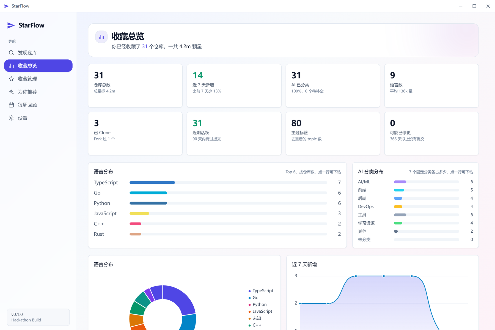
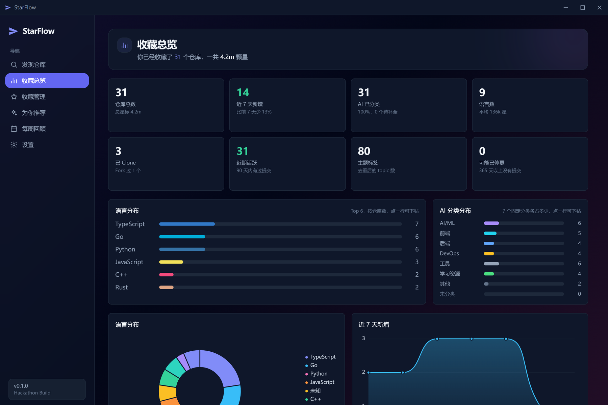
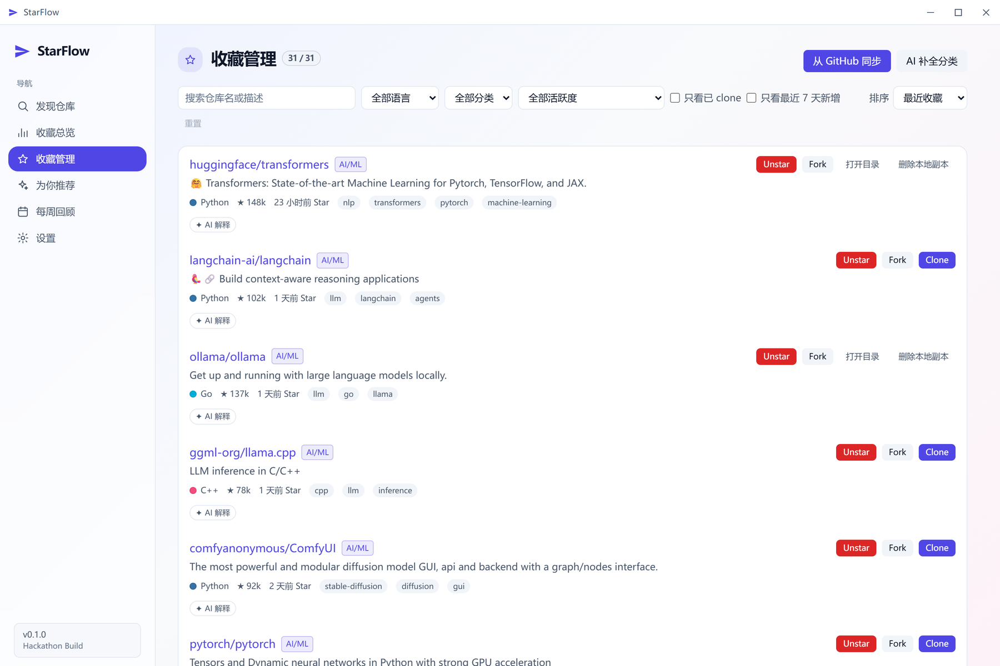
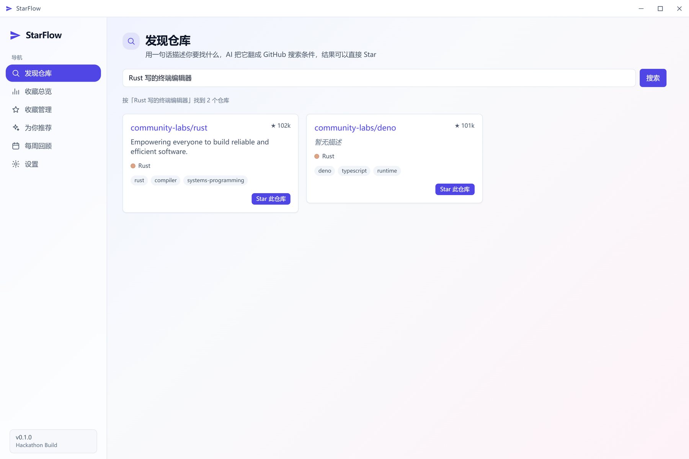
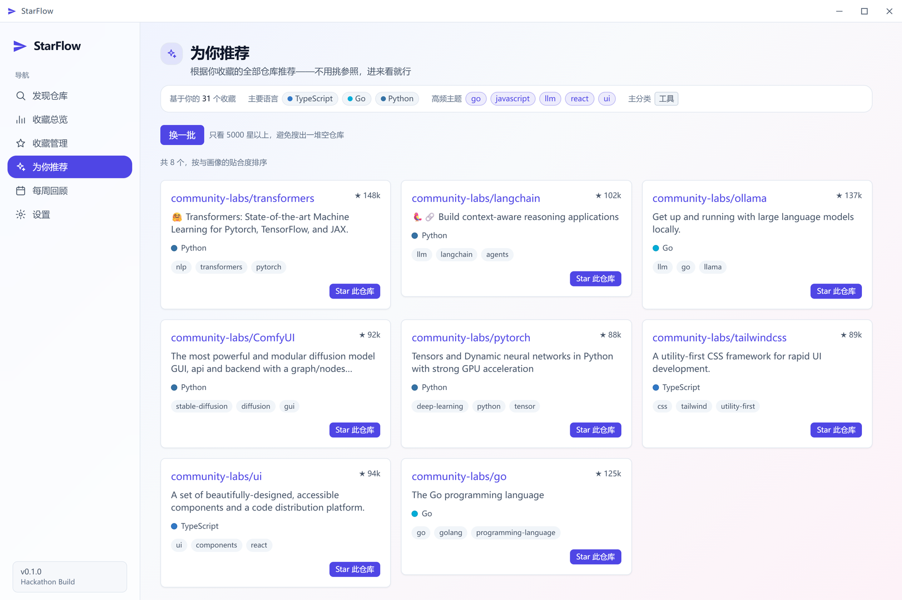
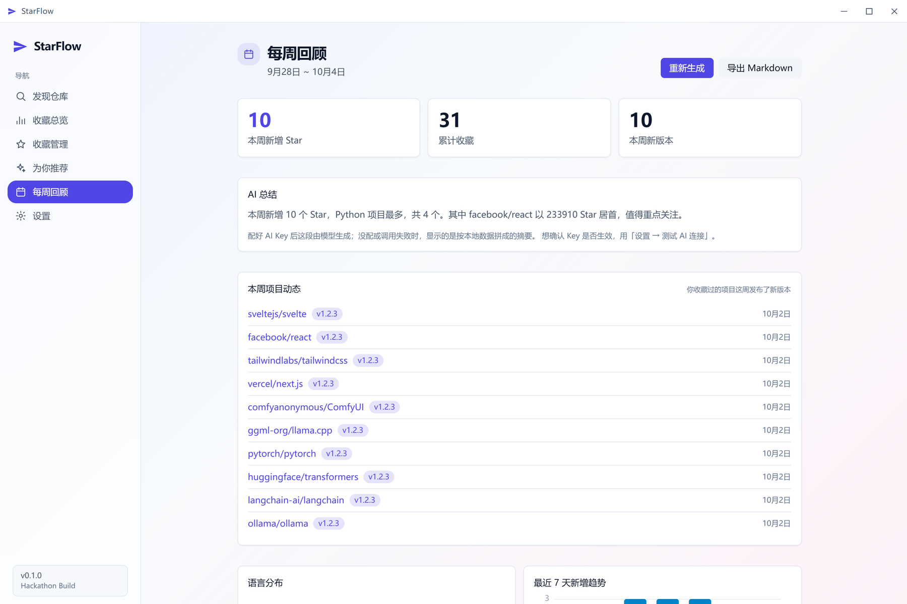
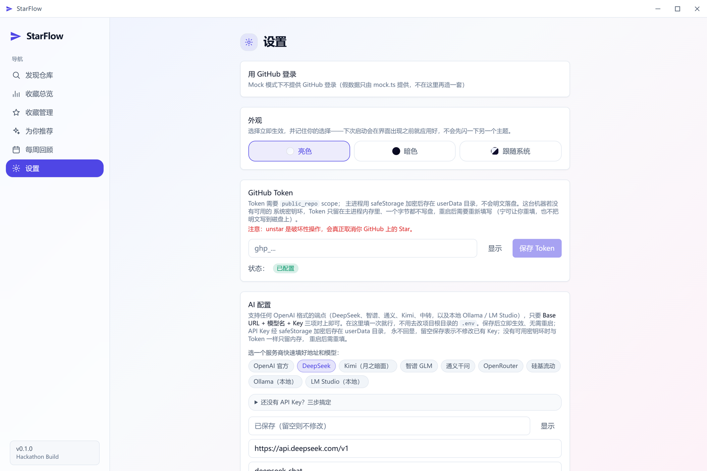
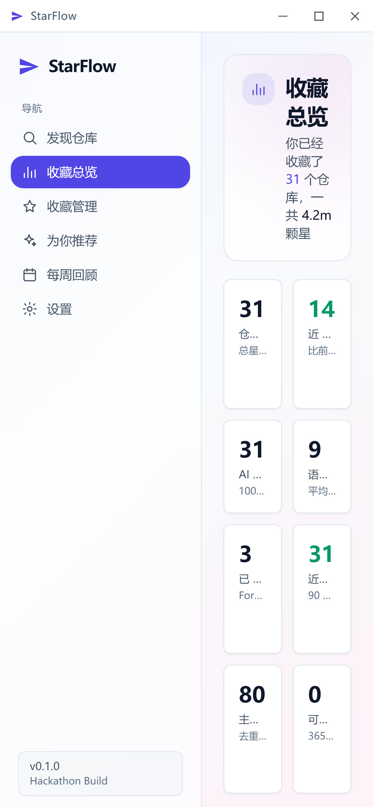
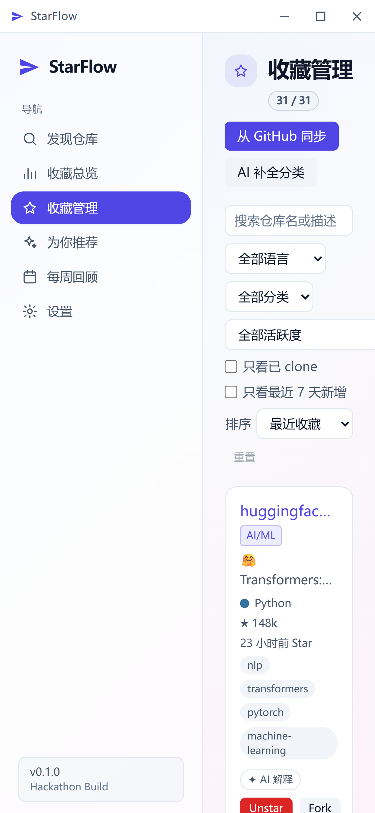
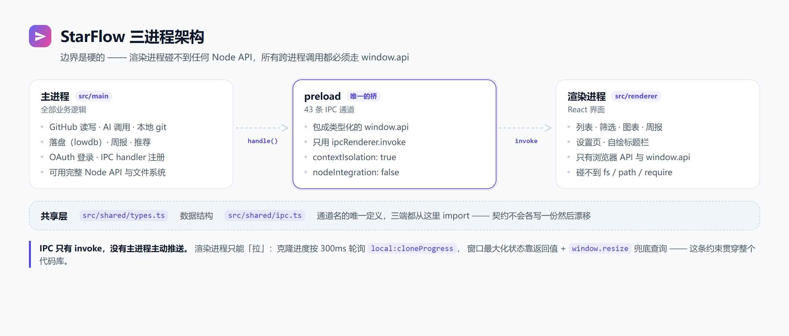

[简体中文](./README.md) | **English**

<div align="center">
  
  <h1>StarFlow</h1>
  <h3>Turn the stars scattered across GitHub into a searchable, reviewable knowledge base</h3>

  <p>
    <a href="./LICENSE"></a>
    
    <a href="https://www.electronjs.org/"></a>
    <a href="https://react.dev/"></a>
    <a href="https://www.typescriptlang.org/"></a>
    <a href="https://nodejs.org/"></a>
    
  </p>
</div>

---

## 📖 Introduction

**StarFlow is an Electron desktop app for managing the repositories you have starred on your own GitHub account.**

Sync your complete star list, let AI classify each repository and write a one-line summary, generate a weekly digest of newly starred repos, clone repositories locally, fork them, and discover similar repositories based on what you have already starred.

The UI is a local window and the data stays local too — apart from GitHub and an optional AI service, nothing goes through any third-party server.

> Repository: [Yuminghuang738/StarFlow](https://github.com/Yuminghuang738/StarFlow)

### The problem it solves

GitHub's built-in features are of little help once you have collected a lot of repositories:

- **The star list can only be viewed in reverse-chronological order.** Once you have a few dozen or a few hundred repos, you can neither filter by language nor search by topic — finding "that Rust parser I saw last time" means paging through the list.
- **A star is where things go to die.** You rarely note down why you starred something, so a few weeks later all that is left is a link and you cannot even recall what problem it solved.
- **There is no built-in answer to "what did I star this week".** GitHub offers no weekly roll-up; the only way to see recent additions is to count them off the list yourself.

StarFlow's approach is to move that list onto your own machine and add the layers GitHub does not provide:

| Pain point | What StarFlow does |
| --- | --- |
| The list is not searchable | Filter by keyword, language, AI category, activity level, and whether a repo is already cloned |
| Starred it, forgot why | AI assigns each repo a category (one of 7 fixed values) plus a one-line Chinese summary |
| No idea what was added this week | Roll up new stars by week with a language breakdown, a daily trend, and a written summary |
| A collection is just a collection | Clone repos locally, fork them to your own account — turn "saved" into "usable" |
| Cannot find similar projects | Recommend new repositories you have not starred yet, based on the profile of your **whole collection**, with the reasoning laid out |

---

## ✨ Core Features

### 🗂 Turn the star list into a searchable library

The manage page is where the app comes into its own: one repository per row in a horizontal strip layout, a dozen or so visible per screen, with all the horizontal whitespace given over to the description.

- **Six filter dimensions**: keyword, language, AI category, activity level, clone status, and whether the repo was added in the last 7 days.
- **Four sort orders**: most recently starred, most stars, most recently updated, name A→Z.
- **The numbers on the overview page drill down** — click "Cloned 3" and you jump straight to the manage page carrying the matching filter, so the card says three and the list shows three.
- **Actions happen right on the row**: Clone, Fork, unstar, open the local directory, delete the local copy.

### 🤖 AI classification and summaries

Each repository gets **one fixed category** (`AI/ML` / `Frontend` / `Backend` / `DevOps` / `Tools` / `Learning` / `Other`) and a one-line Chinese summary — the cure for "I starred it but forgot why".

- The category set is a **closed enum** rather than a free-form model response — otherwise the filter dropdown would grow into a long tail that never converges.
- A single README is enough to produce a summary. Click "AI explain" on a card to trigger it on demand, so no quota is consumed up front.
- **Not tied to OpenAI**: any endpoint speaking the OpenAI format works. The settings page ships presets for DeepSeek / Kimi / Zhipu GLM / Qwen / OpenRouter / SiliconFlow / Ollama / LM Studio — one click fills in the base URL and model. Local endpoints need no API key.

### 📊 Collection overview and weekly review

The overview page reports 8 statistics, a language breakdown, an AI-category breakdown, and a "last 7 days" trend chart, plus an optional **collection profile** — letting the model interpret your taste rather than do arithmetic for you.

The weekly review rolls up new stars by calendar week, showing the week's new releases, the language breakdown and the daily trend, with **one-click export to Markdown**.

> The two notions of "week" are deliberately kept apart: the overview talks about "the last 7 days" (a rolling window that includes today), while the weekly report talks about "this week" (starting Monday 00:00 UTC). Having one word mean two different windows would leave users unable to reconcile the numbers, so the UI never mixes them.

### 🔍 Discover and For You

- **Discover**: describe what you are looking for in a sentence (for example "an offline-capable Chinese OCR library") and AI translates it into GitHub search qualifiers before searching; results can be starred directly. It works without an AI key too — in that case your sentence is passed to the search as-is.
- **For You**: no need to pick a reference repo. The app compresses **your entire collection** into a profile (top languages, frequent topics, dominant category, a star floor), builds queries from that profile, searches, **and displays the profile** so you can see why a recommendation appeared. Clicking "shuffle" re-searches with the lower-ranked languages and topics from the profile.

### 🔐 Keys go in but never come out

- **The GitHub token is encrypted with Electron's `safeStorage` before it is written to disk**, going through the OS keyring — it is never stored in plaintext.
- When encryption is unavailable (for example a Linux box without a keyring), the token **stays in main-process memory only** and not a single byte is persisted; you re-enter it after a restart. This is a deliberate trade-off: better to make you retype it than to write plaintext to disk.
- The AI key goes through `safeStorage` as well and is **write-only**: the configuration view type shown on the settings page has no `apiKey` field at all, so never echoing the key back to the UI is guaranteed at the type level.
- **AI configuration can override `.env` from the UI.** Values entered in the UI take precedence over environment variables and take effect immediately, with no restart.

### 🌗 Light and dark themes · responsive everywhere

Pick light, dark, or follow the system. The theme is decided **before the first paint** — a small synchronous script in `index.html` reads `localStorage` and adds `.dark` to `<html>` first; reading the setting over IPC from the main-process database would necessarily render one frame in the default theme before flipping over, and that flash of white cannot be hidden.

The interface was colour-picked for both themes: the primary colour is darkened in light mode (otherwise it looks washed out on white) and lightened in dark mode (`indigo-500` on `#0f172a` reaches only about a 4:1 contrast ratio). Layouts reflow into a single column on narrow screens.

---

## 📸 Screenshots

<table>
  <tr>
    <td width="50%" align="center"><b>Collection overview</b><br>Stat cards · distributions · trend</td>
    <td width="50%" align="center"><b>Dark theme</b><br>The same page in its other outfit</td>
  </tr>
  <tr>
    <td></td>
    <td></td>
  </tr>
  <tr>
    <td align="center"><b>Manage stars</b><br>Filters · list · Clone / Fork</td>
    <td align="center"><b>Discover</b><br>One-sentence search + star directly</td>
  </tr>
  <tr>
    <td></td>
    <td></td>
  </tr>
  <tr>
    <td align="center"><b>For You</b><br>Recommended from your whole collection's profile</td>
    <td align="center"><b>Weekly review</b><br>Charts · AI summary · export</td>
  </tr>
  <tr>
    <td></td>
    <td></td>
  </tr>
</table>

<table>
  <tr>
    <td width="26%" align="center"><b>Settings</b><br>Theme · token · AI config</td>
    <td width="24%" align="center"><b>Narrow · overview</b></td>
    <td width="24%" align="center"><b>Narrow · manage</b></td>
    <td width="26%" align="center"><b>Architecture</b></td>
  </tr>
  <tr>
    <td></td>
    <td></td>
    <td></td>
    <td><picture><source media="(prefers-color-scheme: dark)" srcset="docs/assets/architecture-dark.png"></picture></td>
  </tr>
</table>

---

## 🚀 Getting Started

### Requirements

| Dependency | Requirement | Notes |
| --- | --- | --- |
| Node.js | **20.19+ or 22.12+** | Required by the `engines` field of Vite 7 and electron-vite 5; below this the dev server will not start |
| npm | Ships with Node | Everything uses standard npm scripts; no extra package manager is required |
| git | **Installed and on `PATH`** | Clone / fork go through `simple-git`, which invokes the system git binary |
| OS | Windows / Linux (packaging targets) | The code itself is cross-platform; `electron-builder.yml` only configures these two targets |

### Local development

```bash
# 1. Clone and install dependencies
git clone https://github.com/Yuminghuang738/StarFlow.git
cd StarFlow
npm install

# 2. Prepare environment variables (all of them may be left empty in mock mode)
cp .env.example .env

# 3. Required once on a fresh clone: electron@44's package.json has no
#    scripts field, hence no postinstall hook, so npm install does not
#    download the Electron binary
npx install-electron --no

# 4. Start (Electron + Vite with hot reload)
npm run dev
```

> [!TIP]
> `MOCK_MODE=true` is the development and demo switch. When it is `true`, the star list, READMEs, releases, commit history, AI results and weekly report **all** come from the fake data in `mock-data.json` (31 demo repositories); no real token is read and your GitHub account is never touched. **Always use mock mode for demos** — `unstar` is an irreversible destructive operation, and `fork` really does create repositories under your account.

### Packaging a distributable app

Packaging is handled by electron-builder, configured in `electron-builder.yml`, with output going to `dist/`.

| Command | What it does |
| --- | --- |
| `npm run build` | `tsc --noEmit` type check + `electron-vite build`, compiling to `out/` |
| `npm run build:win` | Runs `build`, then produces a Windows installer (NSIS) in `dist/` |
| `npm run build:linux` | Runs `build`, then produces a Linux package (AppImage) in `dist/` |
| `npm run dev` | Start in development mode (hot reload) |
| `npm run typecheck` | Type check only, no output |
| `npm run lint` | Full ESLint run |
| `npm run format` | Prettier over `src/**/*.{ts,tsx,css,json}` |

> `electron-builder.yml` only packs `out/**` and `package.json` into the app, so `npm run build` must be run first (`build:win` / `build:linux` already include that step). Only Windows and Linux targets are configured — **there is no macOS packaging script**.

### Environment variables

`.env` is read by `src/main/config.ts` (via `import 'dotenv/config'` at the application entry point) and holds 6 keys:

| Variable | Description | Required? |
| --- | --- | --- |
| `MOCK_MODE` | When `true`, all data comes from `mock-data.json` and no network request is made | Optional, defaults to `false` |
| `GITHUB_TOKEN` | GitHub Personal Access Token. **The current version does not read this key** — the token actually in effect comes from either "Sign in with GitHub" in the app or manual entry on the settings page, and lives in the local data file | Not needed (setting it has no effect) |
| `GITHUB_OAUTH_CLIENT_ID` | Client ID of a GitHub OAuth App, used for Device Flow sign-in | Optional |
| `OPENAI_API_KEY` | Key used for AI summaries / classification / weekly reports | Optional; without it AI features degrade. Local endpoints (Ollama / LM Studio) do not need it |
| `OPENAI_BASE_URL` | Base URL of any OpenAI-compatible endpoint; leave empty to use the official endpoint | Optional |
| `MODEL_NAME` | Model name, e.g. `deepseek-chat`, `glm-4-plus` | **Required** if `OPENAI_BASE_URL` is set; if both are empty it falls back to `gpt-4o-mini` |

The last three keys are only **defaults**: whatever is entered under "Settings → AI configuration" in the app takes precedence. For day-to-day changes, edit it in the UI — that side has preset buttons and a connection test.

### Signing in with GitHub (optional)

The app supports the GitHub OAuth **Device Flow**, so you do not have to paste a PAT by hand. It was chosen because it needs **no `client_secret`**, which means the Client ID can be committed to a public repository without standing up a forwarding backend of your own.

To enable it, register an OAuth App yourself and put its Client ID into `GITHUB_OAUTH_CLIENT_ID`, making sure to **tick Enable Device Flow** during registration.

> A manually entered PAT needs the `public_repo` scope (unstar and fork are write operations) and `read:user` (to read your own star list). Device Flow sign-in uses the same set of scopes.

### Where data and keys live

Application data is stored in Electron's `userData` directory (`~/.config/star-flow/` on Linux) and holds the repository list (including AI category and summary, clone path, and fork flag), the GitHub token, and the AI configuration. **Mock mode uses a separate database file** so that demo data and real data never contaminate each other.

---

## 🏗 Architecture

<div align="center">
  <picture>
    <source media="(prefers-color-scheme: dark)" srcset="docs/assets/architecture-dark.png">
    
  </picture>
</div>

### Three-process layering

The Electron app is split into three layers, and **the boundaries are hard**:

| Process | Responsibility | What it can touch |
| --- | --- | --- |
| **Main** `src/main/` | All business logic: GitHub reads and writes, AI calls, local git, persistence, weekly reports, recommendations, scheduled tracking, OAuth sign-in, and IPC handler registration | The full Node API, the filesystem, the network, and Electron's main-process APIs |
| **preload** `src/preload/` | The one and only cross-process bridge: wraps the 49 IPC channels into a typed `window.api` | `ipcRenderer` (`invoke` only) and `contextBridge` |
| **Renderer** `src/renderer/` | The React UI: lists, filters, charts, the report page, the run log page, the settings page, and a self-drawn title bar | Only browser APIs and `window.api`; **no Node API whatsoever** |
| **Shared** `src/shared/` | The single definition of data structures (`types.ts`) and IPC channel names (`ipc.ts`) | Pure types and constants, imported by all three sides |

The window is created with `frame: false`, so the native title bar and menu are gone; minimise / maximise / close are driven from the renderer's `TitleBar` through channels such as `window:minimize`. The preload script loads with `contextIsolation: true` and `nodeIntegration: false` — the renderer cannot `import` main-process code and cannot use `process` / `require` / `fs` / `path`; every cross-process call has to go through `window.api`.

### The IPC contract

`src/shared/ipc.ts` and `src/shared/types.ts` are the single source of truth for channel names and data structures, and all three sides import from them. Channels are named `module:camelCase`, for example `github:fetchStarred` and `local:cloneProgress`.

There are currently **49 channels**:

| Namespace | Count | Channels |
| --- | --- | --- |
| `github:` | 7 | `fetchStarred`, `fetchReadme`, `fetchReleases`, `fetchCommits`, `unstar`, `fork`, `star` |
| `local:` | 9 | `chooseDir`, `clone`, `openDir`, `cloneProgress`, `removeClone`, `pruneClones`, `cancelClone`, `checkUpdates`, `updateClone` |
| `ai:` | 7 | `summarize`, `classify`, `enrichRepos`, `enrichProgress`, `generateReport`, `testConnection`, `analyzeCollection` |
| `store:` | 6 | `getRepos`, `saveRepos`, `saveToken`, `hasToken`, `updateLocalState`, `clearToken` |
| `store:` (AI config) | 3 | `getAiConfig`, `saveAiConfig`, `clearAiKey` |
| `report:` | 1 | `generate` |
| `log:` | 2 | `tail`, `clear` |
| `recommend:` | 3 | `similar`, `forQuery`, `forYou` |
| `tracker:` | 2 | `start`, `stop` |
| `auth:` | 5 | `getState`, `startDeviceFlow`, `waitForLogin`, `cancelDeviceFlow`, `getUser` |
| `window:` | 4 | `minimize`, `toggleMaximize`, `close`, `isMaximized` |

On the main-process side every handler is registered through a common `handle()` wrapper that wraps the return value into an `IpcResult<T>` (`{ ok: true, data }` on success, `{ ok: false, error }` on failure), so an error thrown by a business function becomes a readable failure result instead of a rejection. On the renderer side, `unwrap()` / `call()` in `src/renderer/src/lib/api.ts` take the result apart again.

> [!IMPORTANT]
> **IPC has `invoke` only — there is no main-process push.** This is a design constraint that runs through the entire codebase: the main process cannot send a message to the renderer at an arbitrary moment; the renderer can only pull. Several direct consequences:
>
> - **Clone progress is polled.** A clone is a long-running `invoke` that does not return for a while, and until it does the renderer gets nothing at all. So the main process parses git's progress lines, caches them in memory, and exposes them on a separate `local:cloneProgress` channel; the renderer's `CloneProgressBar` polls it every 300ms. The progress record is deliberately kept after the clone finishes, so that the final poll does not read an empty value and make the progress bar flash back to nothing.
> - **Window maximise state relies on a return value plus a resize fallback.** `window:toggleMaximize` returns the state **after** the toggle, which is what authoritatively updates the icon; when the window manager resizes the window instead, a `window.resize` listener falls back to querying `window:isMaximized`.
> - **AI classification progress is polled.** Same reason as clone: `ai:enrichRepos` is a long-running `invoke` that can take minutes, and only the main process knows how far along it is. The main process keeps `{ running, done, total }` in memory and the renderer polls `ai:enrichProgress` every 800 ms while the batch runs, showing "enriching 12/40" on the button. That record is **reset to zero the moment the batch ends** (it never sits at 100%), so the UI cannot show a leftover that pretends to be a fresh run; `total === 0` means the total is not known yet, in which case the button just says "enriching…" rather than passing 0 off as progress.
> - **Local clone staleness and the run log are polled too.** `local:checkUpdates` and `log:tail` are both pure in-memory queries. The former runs automatically once per visit to "Manage Stars" (no repeated full `git fetch` within 20 s in the same session); the latter polls every 1.2 s only while the "Run log" page is visible.

### One data flow: syncing the star list from GitHub

Taking "Sync from GitHub" on the manage page as an example, here is how a single call travels through the three processes and reaches disk:

1. The button on `Manage` triggers `repoStore.refreshFromGitHub()`.
2. The store calls `window.api.github.fetchStarred()`. This is a method exposed by preload; internally it runs `ipcRenderer.invoke('github:fetchStarred')` with no arguments.
3. The main-process `handle()` wrapper receives the call, discards the first `event` argument, and forwards to `github.fetchStarred()`.
   - **Mock mode**: returns the data straight out of `mock-data.json`.
   - **Real mode**: uses Octokit against `GET /user/starred` with `Accept: application/vnd.github.star+json` so that `starred_at` is included; 100 per page, paging until a short page is returned (capped at 20 pages = 2000 entries), then sorted by `starred_at` descending.
4. The result comes back to the renderer as `IpcResult<Repo[]>`. The store merges it with the existing local data by `full_name` via `mergeRepos()`, **preserving the local `ai_summary` / `ai_category` / `local` (clone path, fork flag)** — otherwise every sync would throw those markers away.
5. The merged result is sent back to the main process through `store:saveRepos`; `store.saveRepos()` writes the database file atomically with lowdb and updates the in-process read cache.
6. The renderer finally calls `set({ repos: merged })`, the list and charts re-render, and the success toast is shown centrally by the store.

---

## 📂 Directory Structure

| Path | Description |
| --- | --- |
| `src/main/` | The main process. Business modules (`github.ts` / `ai.ts` / `local.ts` / `store.ts` / `report.ts` / `recommend.ts` / `tracker.ts` / `auth.ts` / `mock.ts` / `config.ts`) and `index.ts`, the IPC handler registration entry point |
| `src/preload/` | The one and only cross-process bridge. `index.ts` wraps the 49 channels into `window.api`; `index.d.ts` supplies the renderer's global types |
| `src/renderer/` | The React UI. `src/pages/` (Discover / Overview / Manage / Similar / Report / Logs / Settings), `src/components/` (repo / charts / common / layout / auth / settings), `src/store/` (Zustand), `src/lib/` (api / theme / cn / enrichLabel) |
| `src/shared/` | `types.ts` defines every data structure, `ipc.ts` defines the channel names. The single contract shared by all three sides |
| `docs/` | Main-process module signatures (`module-signatures.md`) and renderer contracts (`renderer-contracts.md`), plus the image assets used by this document |
| `scripts/selfcheck/` | Self-check scripts that need no GUI (see below) |
| `mock-data.json` | The project's only source of fake data, 31 demo repositories |
| `out/` | Build output (gitignored) |
| `dist/` | electron-builder output (gitignored) |

> **Implementation status**: `tracker.ts` (scheduled tracking) is still a placeholder in real mode and only has a working branch in mock mode (in real mode `start` / `stop` throw `NOT_IMPLEMENTED`). Every other module is implemented in both modes — including `recommend.ts` (similar repos / one-sentence search / For You) and `local:cancelClone` (which really does abort a running clone).

---

## 🧪 Self-check Scripts

`scripts/selfcheck/` holds self-check programs that do not need the Electron GUI, used to verify the corners that are hard to reproduce in the UI (key persistence, the multiple safety gates around deleting a local copy, clone progress, the OAuth state machine, and so on).

Most of the scripts bundle the main-process TS modules into an ESM bundle with esbuild at runtime and substitute stub files (`electron-stub.mjs`, `simple-git-stub.mjs`) for Electron and `simple-git`, so they run directly in Node; the two AI-related scripts read bundles pre-built into `out/selfcheck/`. Output goes to `out/selfcheck/` (gitignored).

```bash
node scripts/selfcheck/store-local.mjs    # store.ts / local.ts: stub self-checks, real safeStorage, a real clone
node scripts/selfcheck/local-manage.mjs   # deleting a local copy + reconciling against disk
node scripts/selfcheck/clone-progress.mjs # how clone progress is produced, passed through, and isolated across concurrent clones
node scripts/selfcheck/auth.mjs           # OAuth Device Flow state machine
node scripts/selfcheck/ai.mjs             # AI category convergence, full mock distribution, concurrency cap (some variants need a real endpoint)
```

The end-to-end variant (`node scripts/selfcheck/store-local.mjs e2e`) launches the **build output** and connects to the renderer over CDP to call `window.api.*` directly, verifying that the preload / IPC path is wired up. Those scripts require `npm run build` first. The self-check scripts are not wired into CI.

---

## 🧰 Tech Stack

`dependencies` (bundled with the app, needed at runtime):

| Category | Dependency | Version |
| --- | --- | --- |
| UI | `react` / `react-dom` | `^19.3.0` |
| UI state | `zustand` | `^5.0.15` |
| Animation | `framer-motion` | `^13.5.0` |
| Charts | `echarts` / `echarts-for-react` | `^6.1.0` / `^3.0.6` |
| GitHub | `octokit` | `^5.0.5` |
| AI | `openai` | `^7.25.0` |
| Local git | `simple-git` | `^4.0.2` |
| Local storage | `lowdb` | `^7.0.1` |
| Scheduling | `node-cron` | `^4.6.0` |
| Concurrency | `p-limit` | `^3.1.0` |
| Config loading | `dotenv` | `^18.0.5` |

`devDependencies` (used only for development and packaging):

| Category | Dependency | Version |
| --- | --- | --- |
| Runtime & packaging | `electron` | `^44.5.1` |
| Build | `electron-vite` / `vite` / `@vitejs/plugin-react` | `^5.0.0` / `^7.3.6` / `^5.2.0` |
| Installer | `electron-builder` | `^26.15.3` |
| Language & types | `typescript` / `@types/node` / `@types/react` / `@types/react-dom` | `^5.9.3` / `^22.20.4` / `^19.3.0` / `^19.3.0` |
| Styling | `tailwindcss` / `postcss` / `autoprefixer` | `^3.4.19` / `^8.5.28` / `^10.6.1` |
| Code quality | `eslint` / `typescript-eslint` / `eslint-plugin-react-hooks` / `prettier` | `^9.39.5` / `^8.71.0` / `^7.1.1` / `^3.6.2` |

---

## ❓ FAQ

<details>
<summary><b>The first <code>npm run dev</code> fails with “Electron failed to install correctly”</b></summary>

`electron@44.5.1`'s `package.json` has no `scripts` field, hence no `postinstall` hook, so `npm install` does not download the Electron binary. Just run it once more:

```bash
npx install-electron --no   # equivalent to node node_modules/electron/install.js
```

CI only runs type checks, lint and the build and never starts a GUI, so it is unaffected.

</details>

<details>
<summary><b>AI features say “no API key configured”, but I already put the key in <code>.env</code></b></summary>

Two common causes:

1. **Values on the settings page take precedence over `.env`.** If you saved anything in the UI before (even an empty base URL), the UI value masks the environment variable. Check the currently effective base URL and model under "Settings → AI configuration".
2. **The base URL suffix does not always end in `/v1`.** Zhipu uses `/api/paas/v4` and the Gemini compatibility layer uses `/v1beta` — go by the provider's docs. If you set `OPENAI_BASE_URL` you **must** set `MODEL_NAME`: model names differ between providers and there is no universal default.

Local endpoints (Ollama, LM Studio) **need no key**. The "Test connection" button on the settings page makes one minimal call and classifies any error into plain language, which is much faster than guessing at the configuration.

</details>

<details>
<summary><b>The clone progress bar does not move, or is stuck at 100%</b></summary>

Progress is obtained by the renderer polling `local:cloneProgress` every 300ms, and the main process **deliberately keeps the progress record after a clone finishes** — that is to stop the bar from flashing back to blank at the very end.

The UI therefore only reads that record once **this** clone has actually started (the `cloningFullName` field). If you see a full 100% bar paired with the previous run's elapsed time, that is the leftover record from the previous clone, not this one hanging.

</details>

<details>
<summary><b>The For You page is always empty</b></summary>

Both "For You" and "Discover" need a GitHub token. **Mock mode** does not, but in real mode nothing can be searched without one.

On top of that, GitHub's **search API is tightly rate-limited** (30 requests per minute when authenticated). The app already turned "For You" into at most 3 serial queries, but hammering "shuffle" in quick succession can still hit a 403 — just wait a moment and retry.

</details>

<details>
<summary><b>Could deleting a local copy also wipe some other directory of mine?</b></summary>

No. `local:removeClone` **deliberately accepts only a `fullName`, never a path**: the path is looked up by the main process from its own database, so the renderer never gets the chance to hand an arbitrary path to `rm`. There are several safety gates as well — the main process verifies that the path really is a clone directory it recorded itself, and refuses anything out of bounds. Afterwards the main process returns **the path that was actually deleted**, which the UI uses for its message.

</details>

---

## 🤝 Contributing

Issues and PRs are welcome. Before making changes, it is worth reading these two documents, which record each module's signatures and contracts:

- [`docs/module-signatures.md`](docs/module-signatures.md) — interfaces and implementation constraints of the main-process modules
- [`docs/renderer-contracts.md`](docs/renderer-contracts.md) — contracts of the renderer components

`src/shared/types.ts` and `src/shared/ipc.ts` are **frozen contracts**; please explain your reasoning in the PR description when adding a field or channel rather than changing them unilaterally.

Please make sure all three of the following pass before submitting:

```bash
npm run typecheck
npm run lint
npm run build
```

---

## 📄 License

[GPL-3.0](./LICENSE)
